Para trabajar con los datos, una tabla puede ser  **realmente útil** en tu día a día con Excel.

Sin embargo, ¿qué pasa si es la primera vez que usarás una tabla? ¿y si lo aprendiste pero te has olvidado?

En ese caso sigue leyendo, porque aquí te muestro cómo crear tablas en Excel.

## Pasos para crear una tabla en Excel.

#### _#01_ Nombra las columnas.

Primero debes definir la estructura de tu tabla. Comencemos por los títulos de las columnas que va a tener.

[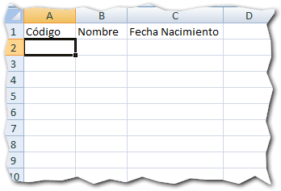](http://raymundoycaza.com/wp-content/uploads/crear-tablas-en-excel-0000151.png)

#### _#02_Ingresa los datos.

Como segundo paso, puedes ingresar los datos correspondientes a cada columna. No es necesario que los ingreses para poder crear tu tabla, pero el ejemplo quedará más claro si lo hago en orden.

[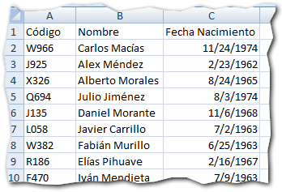](http://raymundoycaza.com/wp-content/uploads/crear-tablas-en-excel-0000161.png)

#### _#03_ Crea tu tabla.

Ya tenemos creada nuestra tabla de datos como lo hemos hecho toda la vida; pero falta "decirle" a Excel que eso es una tabla para que la trate como tal.

Para hacerlo solo debes dirigirte a la pestaña "Insert" y en el grupo "Tables" encontrarás el botón "Table".

[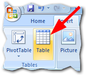](http://raymundoycaza.com/wp-content/uploads/crear-tablas-en-excel-0000171.png)

Debes asegurarte de que tienes seleccionada al menos una de las celdas de lo que será tu tabla, para que Excel pueda reconocerla.

## El proceso en Acción.

[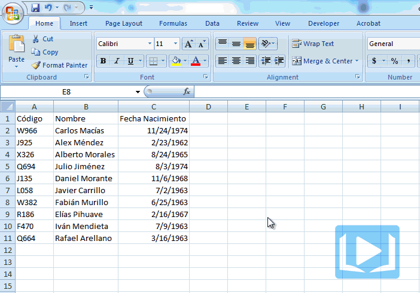](http://raymundoycaza.com/wp-content/uploads/crear-tablas-en-excel-animacion1.gif)

## ¿Existe otra forma de crear una tabla?

En Excel, como en casi todo en la vida, siempre hay más de una forma de hacer las cosas.

Para la versión 2007, por ejemplo, puedes lograr el mismo resultado con la opción "Format as Table" del grupo "Styles".

Aquí te dejo una animación para que puedas ver el procedimiento completo:

[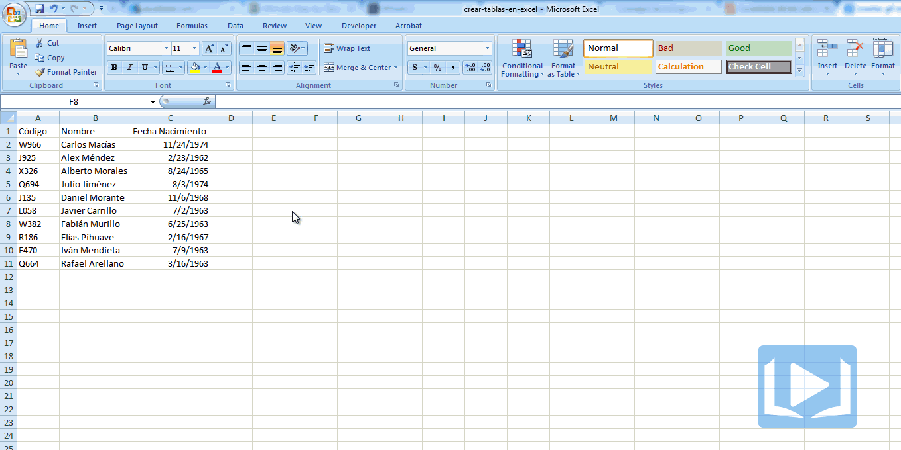](http://raymundoycaza.com/wp-content/uploads/crear-tablas-en-excel-animacion21.gif)

## ¿Por qué usar una tabla?

Ya has visto cómo **crear tablas en Excel**; pero ¿por qué hacerlo? ¿Cuál es la finalidad de las tablas?

La función principal de una tabla es la de **organizar y administrar los datos** eficientemente.

¿Y cómo es que una tabla puede ayudarte a organizar los datos? Pues ofreciéndote una serie de características que te facilitan la tarea. Te citaré unas cuantas:

## Ventajas de usar una tabla.

### 1.- Ordenar los datos y filtrarlos.

Cuando has creado tu tabla, automáticamente aparecerán los filtros junto a los encabezados de tus columnas, permitiéndote ordenar los datos o filtrarlos de acuerdo a tu elección.

[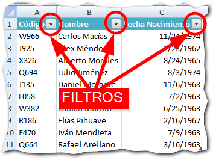](http://raymundoycaza.com/wp-content/uploads/crear-tablas-en-excel-0000181.png)

### 2.- Insertar y eliminar filas o columnas sin afectar el resto de la hoja.

Puedes agregar filas y columnas o eliminarlas sin preocuparte de afectar a las celdas que están fuera del área de la tabla.

[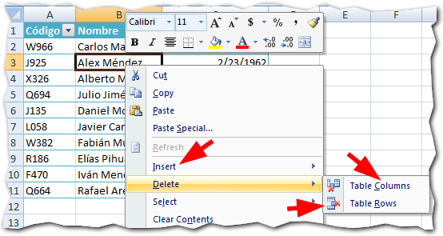](http://raymundoycaza.com/wp-content/uploads/crear-tablas-en-excel-0000191.png)

Esto te da una completa libertad para centrarte solo en los datos de tu tabla.

### 3.- Usar columnas calculadas.

Esta es una de las características que más me gusta de las tablas en Excel.

Una tabla detecta cuando ingresas una nueva línea o registro y esta se amplía **automáticamente** ajustándose al nuevo rango.

Debido a esto, si usas una fórmula en una columna, esta se copiará **también de forma automática** al ingresar un nuevo registro. ¡Excelente!

Dile adiós a esa costumbre de pegar un montón de líneas con tu fórmula y espacios vacíos. Con una tabla las fórmulas se copian solas.

### 4.- Insertar totales.

Aunque son igualmente válidas las fórmulas sobre una tabla, Excel te da la opción de insertar una línea de "total" al final de tu tabla.

Esto crea una línea "especial" claramente diferenciable donde Excel aplicará por defecto el total de cada columna -si aplica-.

Pero también te mostrará una lista desplegable, desde la cual podrás seleccionar la función que quieres aplicar para realizar el cálculo sobre esa columna.

[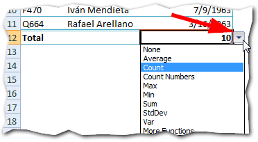](http://raymundoycaza.com/wp-content/uploads/crear-tablas-en-excel-0000211.png)

### 5.- Usar referencias "humanizadas".

Realmente la más útil de las características de una tabla, en mi opinión. Me facilita mucho el trabajo y te voy a contar por qué.

Cuando creabas tus tablas de datos simplemente los escribías sin definir una tabla. Tal vez lo hacías así en algún momento, ¿verdad?

Y dime, ¿qué sucedía cuando desde otra hoja u otra zona de la misma hoja, debías aplicar fórmulas que invocaran datos de esa tabla? ¿O tal vez toda la columna de tu tabla?

Lo que sucedía es que debías **de recordar la referencia** de la columna de tu tabla. En qué columna y fila comenzaba y hasta dónde llegaba (para no tomar otros datos por error)

¿Estoy en lo correcto? ¿Más o menos? Pues bien, todo ese lío te lo ahorras con una tabla.

¿Cómo?

Al ingresar una fórmula, en lugar de usar la referencia de las columnas puedes llamarla por su nombre. Sí, por su nombre. Tal como lo lees.

Usaré como ejemplo mi archivo con la tabla que he creado. Imagina que quisiera saber cuál es la fecha más reciente de la columna "Fecha Nacimiento". Debo de usar la función MAX().

Si lo hiciera "a la antigua", escribiría la fórmula de la siguiente manera:

[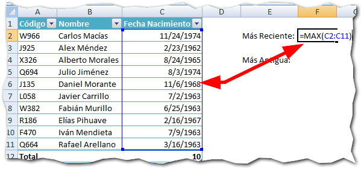](http://raymundoycaza.com/wp-content/uploads/crear-tablas-en-excel-0000221.png)

### ¿Cuáles son las desventajas de esto?

- Si tu tabla crece al ingresar más datos, la referencia debe actualizarse en tu fórmula.
- Debes recordar la ubicación de cada rango o moverte por la pantalla y seleccionar con el ratón el rango.
- Si no anclas la fórmula, fácilmente se puede desplazar el rango por error.

### Cuando usas una tabla.

Si utilizas una tabla, las cosas cambian, ya que puedes usar esta forma de referirte a las columnas:

[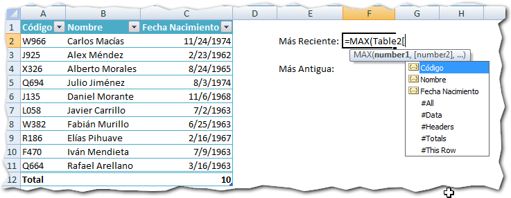](http://raymundoycaza.com/wp-content/uploads/crear-tablas-en-excel-0000231.png)

Como puedes ver en la imagen anterior, en lugar de usar la "referencia dura" puedo referirme directamente al nombre de la columna. Lo que por supuesto, es **más fácil de recordar**.

Lo único que debes hacer es escribir el nombre de tu tabla (comienza por Table1 y aumenta la secuencia por cada tabla que vayas creando) y a continuación abres un corchete (\[)

Excel detectará tu intención y te mostrará un listado con todos los nombres de columnas que tiene tu tabla, más otras opciones que puedes explorar.

Recuerda que al seleccionar un nombre de columna, debes cerrar el corchete o posiblemente Excel te marcará un error.

[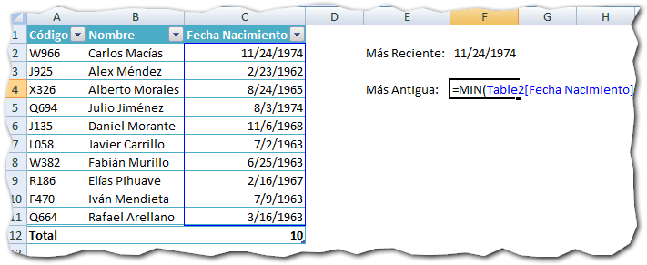](http://raymundoycaza.com/wp-content/uploads/crear-tablas-en-excel-0000241.png)

Para mi ejemplo, solo utilizo la columna "Fecha Nacimiento" y funcionará como si hubiera escrito directamente la referencia; pero con las ventajas ya explicadas:

- Fácil de recordar los nombres de las columnas en lugar de las referencias.
- El rango se ajusta automáticamente al área de la columna, no importa si la tabla crece o decrece.
- No hace falta anclar la referencia. Puedes estar seguro de que no se desplazará por error.
- Tu sistema quedará mucho más estructurado al aplicar el uso de tablas sin tener que crear varios nombres definidos.

**Consejo adicional:** Para facilitar aún más el asunto, puedes ponerle un nombre a tu tabla. Esto lo consigues si seleccionas tu tabla y te diriges a la pestaña "Design" (1) y en la sección "Properties" econtrarás una caja de texto donde podrás darle el nuevo nombre a tu tabla.

## Crear tablas en Excel es una buena práctica.

Como te mencioné al principio, las tablas en Excel son realmente útiles a la hora de administrar y organizar datos.

Aunque en un principio pudiera parecer que dan más problemas que soluciones, la verdad es que crear tablas en Excel te ayudan a estructurar mucho mejor tus planillas.

Hoy has aprendido (o recordado) una de las características de Excel que más aportan a mejorar tu desempeño con esta hoja de cálculo. No dejes de practicar su uso para afianzar el conocimiento.

Recuerda que si juntas cada uno de los consejos que te expongo en este blog y los usas en conjunto, estarás realmente **liberando tu productividad**.

¡Hasta la próxima!
