Si administras cualquier tipo de proyecto en tu trabajo o, lo que es muy común, en el desarrollo de tu tesis, en algún momento necesitarás llevar un control gráfico de las etapas de dicho proyecto.

El **Diagrama de Gantt** es la herramienta preferida para esta tarea, ya que este muestra de un solo vistazo los avances de cada etapa del proyecto y te permite inclusive realizar el seguimiento del avance de cada una de las personas responsables de dicha etapa.

La herramienta **Microsoft Project** es la primera opción que se le viene a la mente a las personas que ya han trabajado en proyectos (y seguramente a tu profesor también), pero si necesitas salir del apuro, puedes valerte de Excel para crear tu propia herramienta de control, sencilla y únicamente con las cosas que realmente vas a usar.

## Creando tu Diagrama de Gantt en Excel en 3 pasos.

Para crear tu Diagrama de Gantt, debes partir de una tabla en la que tengas las etapas que componen tu  proyecto y el tiempo estimado que te tomarás en llevarlas a cabo.

Como mínimo, necesitas un cuadro similar a este:

[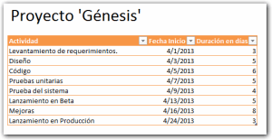](http://raymundoycaza.com/wp-content/uploads/grafico-de-gantt-en-excel-000427.png)

#### _#1_ Creando un gráfico de barras apiladas.

Una vez listo tu cuadro, vas a insertar un gráfico en la ficha 'Insertar' y eliges el tipo 'Barra'. Asegúrate de elegir el subtipo 'Barras apiladas' como te muestro en la siguiente imagen.

[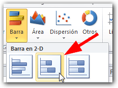](http://raymundoycaza.com/wp-content/uploads/grafico-de-gantt-en-excel-000428.png)

Te quedará un gráfico en blanco en el que tendrás que reflejar los datos de tu tabla:

Pincha con el botón derecho sobre el gráfico y se mostrará el menú contextual. En él debes elegir la opción 'Seleccionar datos...'.

[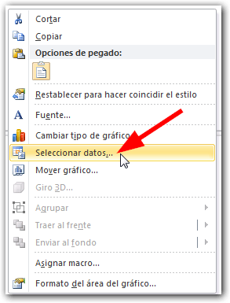](http://raymundoycaza.com/wp-content/uploads/grafico-de-gantt-en-excel-000430.png)

Verás el cuadro de diálogo 'Seleccionar origen de datos'. Aquí vas a seleccionar las series una por una, así:

[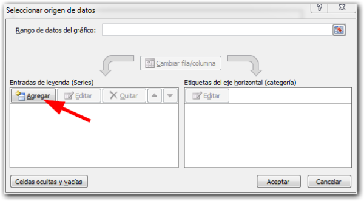](http://raymundoycaza.com/wp-content/uploads/grafico-de-gantt-en-excel-000431.png)

Pincha en el botón 'Agregar' y elegirás como fuente de datos la columna 'Fecha inicio'.

[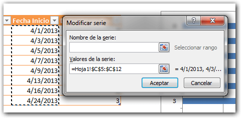](http://raymundoycaza.com/wp-content/uploads/grafico-de-gantt-en-excel-000432.png)

Pincha en el botón 'Aceptar' y tendrás ya el eje horizontal en el que se mostrará la fecha. Ahora vas a crear las etiquetas de las categorías. Para esto, pincha en el botón 'Editar' que está en el panel de la derecha:

En el siguiente cuadro, elegirás la columna 'Actividad'.

[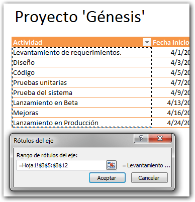](http://raymundoycaza.com/wp-content/uploads/grafico-de-gantt-en-excel-000434.png)

Y por último, debes agregar la segunda serie de datos que será la 'Duración en días'. Pincha nuevamente en el botón 'Agregar' y repite la operación, ahora con la columna de días.

Pincha en 'Aceptar' y en el otro cuadro, también pincha en el botón 'Aceptar'. Debes tener un gráfico similar a este:

#### _#02_ Retocando el gráfico.

Ya en esta parte, debes eliminar las series porque no nos sirven de nada en este momento, de manera que salen sobrando.

Lo siguiente que harás, será pasar el eje de las fechas a la parte superior, esto lo consigues pinchando con el botón derecho sobre el eje vertical (donde están las categorías) y eliges la opción 'Dar formato a eje...'.

[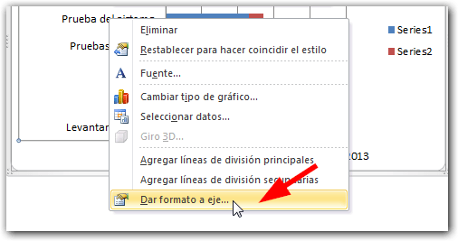](http://raymundoycaza.com/wp-content/uploads/grafico-de-gantt-en-excel-000437.png)

Aquí solo tienes que pinchar y marcar la opción 'Categorías en orden inverso'. Pincha en el botón 'Cerrar' cuando ya esté marcada la opción.

[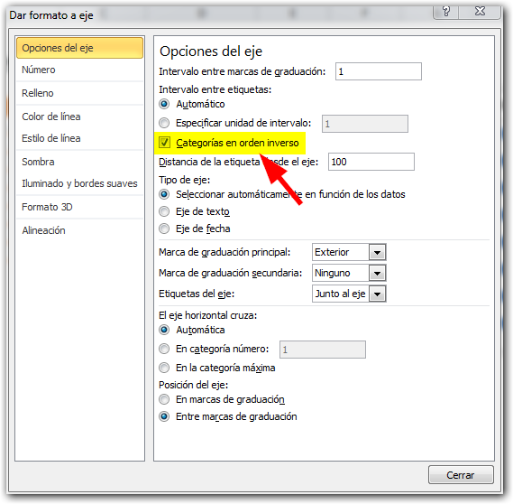](http://raymundoycaza.com/wp-content/uploads/grafico-de-gantt-en-excel-000438.png)

Ahora, si te fijas bien, notarás que la parte azul no es otra cosa que el tiempo transcurrido desde el primer día de nuestro gráfico, mientras que la parte roja es el tiempo que se toma en realizar la tarea.

De aquí, como ya has deducido, la parte azul no nos interesa y sale sobrando. Pincha sobre la serie azul con el botón derecho y elige la opción 'Dar formato a serie de datos...'

[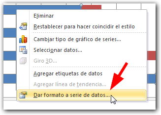](http://raymundoycaza.com/wp-content/uploads/grafico-de-gantt-en-excel-000439.png)

En el cuadro que aparece, elige la categoría 'Relleno' y luego elige la opción 'Sin relleno'.

Verás que ahora la parte azul de tu gráfico ha desaparecido (en tu caso puede ser cualquier otro color, así que guíate por la ubicación)

Hasta aquí ya tienes tu Gráfico de Gantt en Excel; pero tenemos dos pequeños inconvenientes:

1. El formato de fecha no deja ver claramente en qué fecha nos encontramos.
2. Hay mucho espacio a la izquierda que no corresponde al rango de fecha de nuestro proyecto.

#### _#03_ Ajustando el formato del eje de las fechas.

Pincha con el botón derecho sobre el eje que tiene las fechas y elige la opción 'Dar formato a eje...'

[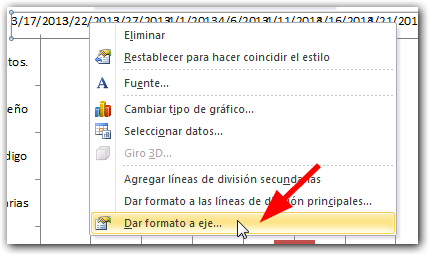](http://raymundoycaza.com/wp-content/uploads/grafico-de-gantt-en-excel-000441.png)

Selecciona la opción 'Número' y en la sección 'Categoría' elige 'Personalizado'. En el cuadro 'Código de formato', escribe "dd/mm" y pincha en el botón 'Agregar' y luego en 'Cerrar'.

Verás que ahora tu gráfico muestra la fecha en un formato más corto (día y mes).

Sin embargo, aún tienes que resolver el tema del espacio en blanco a la izquierda. Pincha nuevamente en el eje horizontal con el botón derecho y elige la opción opción 'Dar formato a eje...'

En la sección 'Opciones del eje', cambia la opción 'Mínima' y déjala como 'Fija'. En el cuadro que está junto a ésta, escribe la fecha inicial de tu proyecto, en mi caso 4/1/2013 y pincha en el botón 'Cerrar'.

[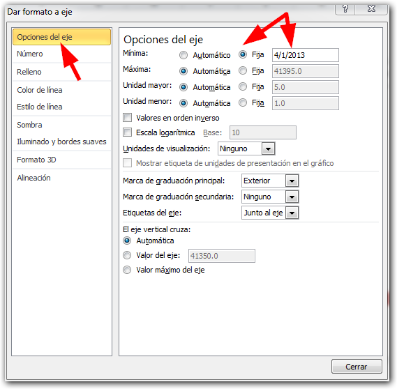](http://raymundoycaza.com/wp-content/uploads/grafico-de-gantt-en-excel-000443.png)

Y ya tienes listo tu Gráfico de Gantt en Excel. Tan sencillo como eso.

A partir de aquí, puedes implementar varias mejoras que seguramente lo harán todavía más útil, como agregar una etiqueta con los días asignados a cada tarea, el nombre del responsable o inclusive un porcentaje de cumplimiento. ¡El límite lo pones tú!

## El ejemplo terminado.

Este es mi ejemplo terminado _con un par de sencillos ajustes adicionales_. ¿Qué te parece?

[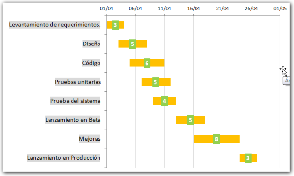](http://raymundoycaza.com/wp-content/uploads/grafico-de-gantt-en-excel-000444.png)

_**¿Quieres saber más?**_ [Curso de Excel - Aprende a realizar gráficos.](http://raymundoycaza.com/aprende-a-crear-graficos-en-excel/)

## Descarga el archivo terminado.

[Si quieres el archivo terminado para analizarlo pincha aquí](http://raymundoycaza.com/wp-content/uploads/grafico-de-gantt-en-excel.xlsx "Descarga el archivo terminado").

Anímate y muéstrame cómo quedó tu Gráfico de Gantt, si le has agregado alguna funcionalidad adicional o un efecto chulo.

Si te ha quedado algo en el aire, déjamelo saber en los comentarios.

¡Nos vemos!

\[firma\]
