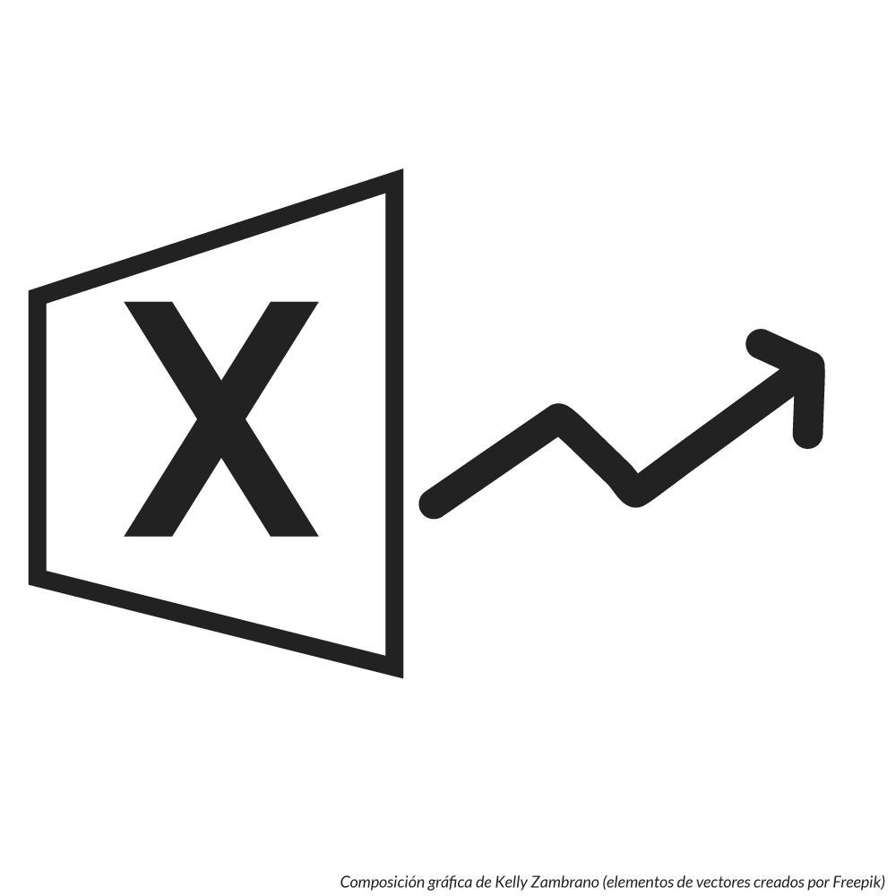
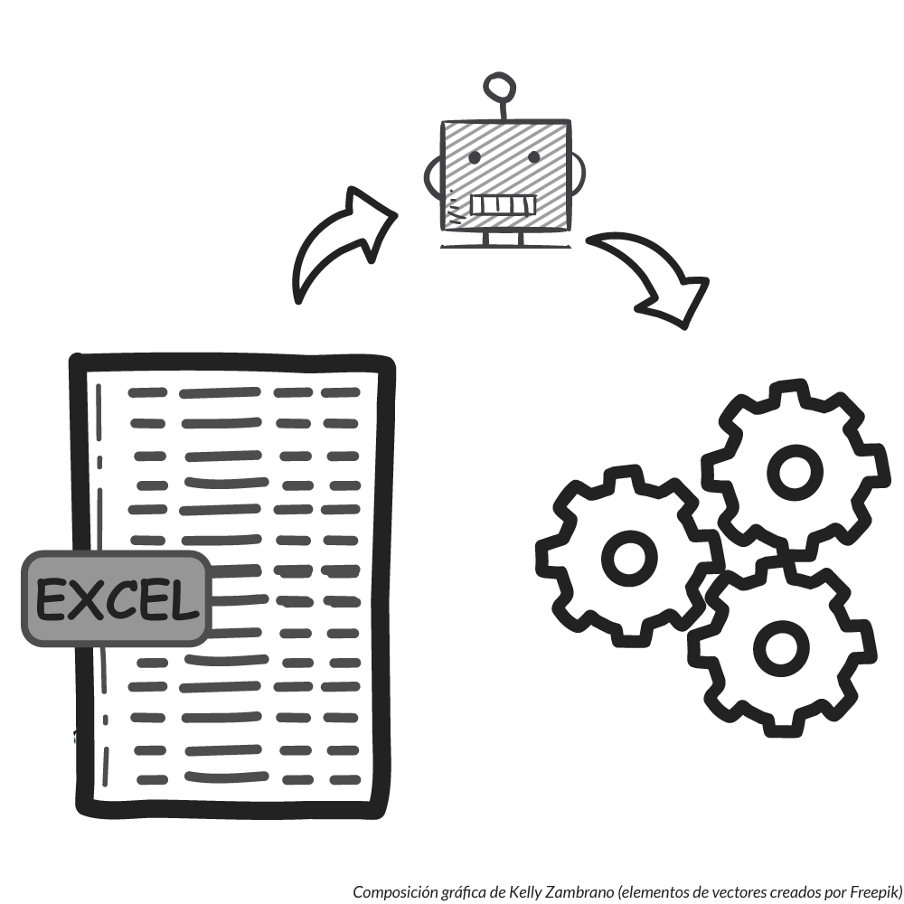

En un mundo donde la tecnología avanza a pasos agigantados y las nuevas herramientas como **Python** y **Power BI** prometen revolucionar el **análisis de datos**, es fácil caer en la conclusión de que **Excel ha quedado obsoleto**. 

Sin embargo, un ejercicio de observación desapasionada podría revelarte un fenómeno interesante: Excel no solo está vivo, sino que sigue siendo un pilar fundamental en la gestión de datos y **automatización de procesos** para muchas empresas, especialmente en el ámbito de las micro y pequeñas empresas que son el público objetivo de este blog.

De vez en cuando, me encuentro en redes sociales con el iluminado de turno que dice que la nueva herramienta del momento ha terminado con Excel: "Excel está muerto".

Cuando eso pasa recuerdo que, afortunadamente, aún existen personas que tienen el ánimo de exponer sus argumentos en contra de este "error", [como ya lo hizo Quique Arranz en su publicación de LinkedIn](https://www.linkedin.com/posts/enriquearranz_dicen-que-excel-est%C3%A1-muerto-por-la-llegada-activity-7262814173472940032-GBGc).

Pues no. La verdad es que no lo está. No lo digo únicamente yo, sino las miles de personas que encuentran en Excel una herramienta poderosa para mover los datos de su negocio.

Pues verás, si echamos un vistazo rápido a las impresiones de las personas en plataformas como [Reddit](https://www.reddit.com/r/FinancialCareers/comments/nczg09/no_excel_is_not_dead/) y LinkedIn, notarás que destaca la capacidad de Excel para realizar tareas que requieren un **enfoque humano** en la toma de decisiones, lo que lo convierte en una herramienta indispensable. 

Además, la integración de tecnologías emergentes, como la [incorporación de Python en Excel](https://techcommunity.microsoft.com/blog/excelblog/python-in-excel-%E2%80%93-available-now/4240212), incluso de tecnologías disruptivas como la inteligencia artificial, subraya su adaptabilidad y potencial de mejora continua.

Lo cierto es que Excel es tan versátil que puede integrarse con muchas soluciones tecnológicas de vanguardia, incluso puedes usarlo en un flujo de automatización de herramientas como **n8n**.

¡Pues ya me dirás tú lo acabado que está Excel!

¿Y por qué elegirías Excel para un flujo de automatización, habiendo otras opciones?

Bueno, podríamos hablar de su **accesibilidad**. Prácticamente cualquier persona en una oficina, tiene acceso a Excel, lo que hace que sea fácil de configurar y compartir. Configurar un archivo de Excel es mucho más rápido y accesible que configurar una instancia de **Nocodb** ya sea con SQLite o PostgreSQL.

Dejemos que los hechos hablen por sí mismos: estas son las razones por las que yo sostengo que Excel sigue siendo un pilar irremplazable (al menos por ahora) en el mundo empresarial.

## La Evolución de Excel en la Automatización

Excel no solo ha sido una herramienta de hojas de cálculo, sino que **ha evolucionado constantemente** para adaptarse a las necesidades empresariales modernas. 

No se puede obviar el surgimiento de nuevas herramientas como **Python** y **Power BI**, sin embargo muchos nos preguntamos: ¿realmente ha quedado atrás Excel? 

Con este artículo busco desmitificar esa creencia, mostrando cómo Excel sigue siendo un aliado clave en la automatización de procesos empresariales.

## Excel Sigue Siendo Relevante
La relevancia de Excel radica en su **accesibilidad** y en la **familiaridad** que millones de usuarios han desarrollado a lo largo de los años. 

Al ser una herramienta que se puede usar sin la necesidad de aprender un nuevo software, se ha convertido en la opción preferida en muchas empresas. Además, su capacidad para crear **modelos financieros complejos** rápidamente lo hace indispensable en la toma de decisiones estratégicas.

Tú puedes montar un sistema en **Airtable**, **Baserow** o **Nocodb** (por citar algunos), pero ¿te imaginas moviendo tus proyecciones financieras en estas herramientas?

No estoy desmeritando a estas herramientas, todo lo contrario, sé que son muy robustas; pero no tienen la misma agilidad que tiene Excel para gestionar tus datos, especialmente cuando requieres hacer cambios masivos, frecuentes y en muy cortos intervalos de tiempo (copiar/cortar pegar, mover, cambiar a otra hoja, cambiar tipos de datos, etc.).

Incluso existe cierta tendencia a reemplazar Excel con soluciones más complejas, más costosas y muchas veces menos eficientes (el contexto en el que son utilizadas). Algo de esto se menciona en el [post de LinkedIn publicado por Joan Francesc Recasens Collado](https://www.linkedin.com/pulse/excel-el-eterno-enemigo-o-joan-francesc-recasens-collado/).

Entonces yo te pregunto: Si te encuentras ejecutando exitosamente la mayoría de tus actividades en Excel, ¿por qué pensarías en abandonarlo?

Volcar todas tus actividades a una herramienta nueva y desconocida para tu personal.

¿Solo por la aparición de esa "**herramienta todo en uno**" que está causando revuelo?

## Excel sirve para mover datos
Generalmente, los gurús de turno utilizan el "argumento" de que Excel no es seguro y que pueden acceder a tu archivo aunque pueda tener contraseña.

¿Y eso qué?

Excel es para lo que es: "mover datos" o, si lo prefieres, capturar, organizar, limpiar y analizar datos.

Según como yo lo veo, las opciones de "seguridad" que tiene Excel, están más orientadas a evitar que un archivo sea modificado por alguien dentro de la empresa "por error", en el entendimiento de que estamos exponiendo este archivo en una carpeta compartida para darle acceso a varias personas.

Y doy por hecho que tú guardas el archivo original en un lugar seguro.

¿Tengo razón?

## Automatización de Tareas Comunes con Excel

### Ejemplo 1: Creación de Informes Automáticos
Una de las funciones más poderosas de Excel es la posibilidad de automatizar la generación de informes. 

Utilizando fórmulas avanzadas y la **implementación de macros**, los usuarios pueden crear informes dinámicos que se actualizan con solo presionar un botón. 

Por ejemplo, imagina que quieres elaborar un informe de ventas mensual: mediante la automatización, Excel puede generar automáticamente gráficos y tablas de resumen con datos actualizados, ahorrándote horas de trabajo.

Además de las macros, puedes utilizar **Python** para gestionar los datos y generar ese reporte usando un lenguaje que **podría** resultarte más amigable. Si a esto le sumamos la Inteligencia Artificial que entiende muy bien los scripts de Python, entones el asunto se pone muy interesante.

### Ejemplo 2: Gestión de Datos
Excel es también una excelente herramienta para la gestión de datos. 

Con su capacidad para importar datos desde diferentes fuentes como bases de datos SQL, CSV y otros formatos, podemos centralizar información valiosa en un solo lugar. 

Imagina que administras un inventario: usando Excel, puedes construir un registro que se actualice automáticamente conforme recibes nuevos productos, eliminando errores manuales y optimizando el seguimiento de stock.

¿Recuerdas que te mencioné a **Nocodb**?

Pues podrías instalar esta **plataforma de bases de datos no-code**, para implementar un backend robusto en tu negocio y usar a Excel para consultar los datos de Nocodb, conectándote a su API a través de **Power Query**.

¡Imagina las posibilidades!

## Integración de Nuevas Tecnologías
La verdadera fortaleza de Excel hoy está en su capacidad de integración. No solo hablamos de la reciente incorporación de Python, que ya es revolucionaria por sí misma, sino de todo un ecosistema de posibilidades:

- Power Query permite conectar Excel con prácticamente cualquier fuente de datos, desde APIs hasta bases de datos SQL
- La función SERVICIOWEB te permite consumir datos de tus propios servicios web directamente desde las celdas
- Power Pivot ofrece capacidades de análisis de datos comparables a herramientas especializadas
- La integración con Microsoft Power Platform permite crear flujos de automatización completos

¿Te das cuenta? Excel ya no es solo una hoja de cálculo, es una plataforma que se integra con todo tu stack tecnológico.

## Mitos Comunes sobre Excel
Algunas creencias comunes pueden menospreciar la capacidad de Excel. 

Vamos a desmentir algunos mitos que escuchamos constantemente:

**"Excel no es seguro para datos empresariales"**

¡Por favor! Excel no es una base de datos y nunca pretendió serlo. 

Es una herramienta para mover, analizar y visualizar datos. 

Si necesitas seguridad empresarial, usa la herramienta adecuada para ello.

> Recuerda que un documento impreso tampoco tiene seguridad, eres tú quien debe guardarlo en una caja fuerte.

**"Excel no puede manejar grandes volúmenes de datos"**

Power Query y Power Pivot pueden manejar millones de filas eficientemente. 

¿Realmente necesitas más que eso para tu análisis diario?

Si es así, tal vez no estemos hablando de una pequeña o mediana empresa, o puede que tengas un rubro muy específico.

**"Las macros son obsoletas"**

Las macros siguen siendo una herramienta poderosa para automatizar tareas repetitivas. Con la integración de Python, ahora tienes lo mejor de ambos mundos.

## Recursos y Herramientas para Potenciar el Uso de Excel

¿Quieres llevar tu Excel al siguiente nivel? 

Aquí tienes algunas sugerencias concretas:
- Power Query: Imprescindible para la limpieza y transformación de datos. Es como tener un ETL dentro de Excel.
- Power Pivot: Si trabajas con grandes volúmenes de datos o necesitas crear modelos de datos complejos, este es tu complemento.

Complementos populares:

- ASAP Utilities para automatizar tareas comunes
- Kutools para funciones avanzadas de productividad
- XLTools para análisis financiero

Y no olvides los recursos de aprendizaje:

- Microsoft Learn ofrece cursos gratuitos excelentes
- La comunidad de Excel en Reddit (/r/excel) es increíblemente útil
- Canales de YouTube como ExcelIsFun o Leila Gharani son verdaderas joyas

## **Conclusión**

Excel no solo está vivo, está más fuerte que nunca. Su capacidad para adaptarse e integrar nuevas tecnologías, junto con su facilidad de uso y disponibilidad universal, lo mantienen como una herramienta fundamental en cualquier entorno empresarial.

¿Significa esto que Excel es la mejor herramienta para todo? 

Por supuesto que no. 

Pero su versatilidad, combinada con las nuevas integraciones como **Python** y **Power Platform**, lo convierten en un componente esencial de cualquier stack tecnológico moderno.

La próxima vez que alguien te diga que Excel está muerto, muéstrale cómo estás usando Python dentro de Excel, conectándote a tus APIs favoritas, o automatizando reportes complejos. 

La realidad es que Excel sigue evolucionando y adaptándose, justo como lo necesitamos en el mundo empresarial actual.

¡Nos vemos! 🐌