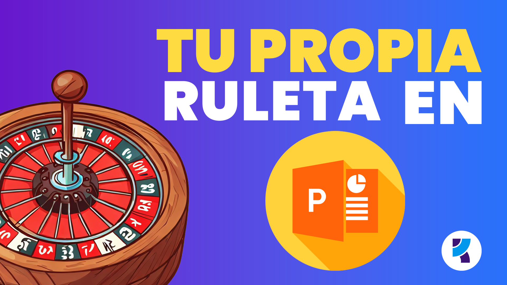

import Firma from '@components/PostFooter.astro'
import { Image } from 'astro:assets'
import Imagen1 from './images/20140225-crea-tu-propia-ruleta-con-powerpoint000240.png'
import Imagen2 from './images/20140225-crea-tu-propia-ruleta-con-powerpoint000241.png'
import Imagen3 from './images/20140225-crea-tu-propia-ruleta-con-powerpoint000242.png'
import Imagen4 from './images/20140225-crea-tu-propia-ruleta-con-powerpoint000243.png'
import Imagen5 from './images/20140225-crea-tu-propia-ruleta-con-powerpoint000244.png'
import Imagen6 from './images/20140225-crea-tu-propia-ruleta-con-powerpoint000245.png'
import ImagenAnimada from './images/20140225-crea-tu-propia-ruleta-en-powerpoint_animacion.gif'
import Portada from './images/ruleta-con-powerpoint_portada.png'

Siempre me ha gustado hacer mis propias herramientas, porque me permite cierto control sobre lo que éstas hacen y puedo saber cómo lo hacen para adaptar rápidamente su comportamiento cuando las reglas del negocio cambian.

Hace unos días, una presentación de última hora en la universidad, en la que tenía que dar una breve clase sobre probabilidad, me trajo a la mente la idea de crear una ruleta, para hacer un poco más divertida la clase y juguetear un poco con los ejemplos que íbamos a ver durante 45 minutos.

## Más sencillo de lo que crees.

No, no te creas que es complicado. La versión que vamos a realizar tú y yo, no tiene nada que ver con una compleja aplicación que haga de todo. Es simplemente crear una ruleta que gire cuando le digas y deje de hacerlo en el momento que hagas nuevamente un clic sobre ella.

Dicho todo esto, empecemos:

### 1: Tener lista una imagen

Lo primero que tienes que tener a la mano (y tal vez lo más complicado de este sencillo ejemplo) es la imagen de la ruleta en sí. Yo usaré esta que te muestro a continuación:

<Image src={Imagen1} alt="Raymundo Ycaza" />

### 2: Insertar la ruleta en Power Point y ponerla a girar

Ahora, sólo debemos insertar la imagen que ya tienes en tu disco duro. Debemos pinchar en la pestaña "Insertar" y luego en el botón "Imagen", buscamos la imagen de la ruleta y aceptamos:

<Image src={Imagen2} alt="Raymundo Ycaza" />

Si pinchas sobre la ruleta y eliges la pestaña "Animaciones", encontrarás la animación "Girar". Utilízala para que la ruleta haga un giro de 360 grados:

<Image src={Imagen3} alt="Raymundo Ycaza" />

Antes de hacer nada más, en la misma pestaña "Animaciones" encontrarás el botón "Panel de animación". Úsalo para que aparezca dicho panel a la derecha y en él verás la animación de la ruleta. Modifica ahora los parámetros de esta animación para hacer que nuestra ruleta se comporte como esperamos:

<Image src={Imagen4} alt="Raymundo Ycaza" />

Ahora aparecerá una ventana. Lo único que vamos a cambiar aquí, está en la pestaña "Intervalos". Debes asegurarte de que tenga los valores que te muestro en la imagen. Es decir, inicio al hacer clic. Un retraso de 0 segundos y, muy importante, repetir hasta el siguiente clic.

La duración, la dejo tu gusto, pero yo la prefiero en 1 segundo (rápido).

<Image src={Imagen5} alt="Raymundo Ycaza" />

Finalmente, le agregaremos un texto o cualquier objeto que aparezca después de la animación de la ruleta, para evitar que se "pase de largo".

**¡Y listo! Tu ruleta ya está funcionando.**

<Image src={Imagen6} alt="Raymundo Ycaza" />

## Unos retoques más y...

Ahora puedes presumir tu flamante ruleta hecha en PowerPoint y lista para que le agregues cualquier detalle adicional, para que se adapte a tus nececisades puntuales. Yo le hice un par de ajustes sencillos y este es el resultado:

<Image src={ImagenAnimada} alt="Raymundo Ycaza" />

## ¿Quieres descargar el archivo terminado?

Si quieres descargar esta ruleta con PowerPoint, ya terminada, sólo sigue las instrucciones. Es gratis.

[Pincha aquí para descargar.](https://www.dropbox.com/scl/fi/xynxuf6z1e3bc2ffawo7m/20140226-crea-tu-propia-ruleta-en-powerpoint_descarga.pptx?rlkey=mopb1nh5dhikefvedaem0vtfl&dl=1)

## Conclusión

Como ves, no se trata necesariamente de cosas complejas. A veces, las soluciones más sencillas suman entre ellas lo suficiente como para sacarnos de más de un apuro y, si le pones algo de creatividad, lograrás realizar cosas realmente útiles. De eso se trata.

¡Nos vemos!

<Firma />