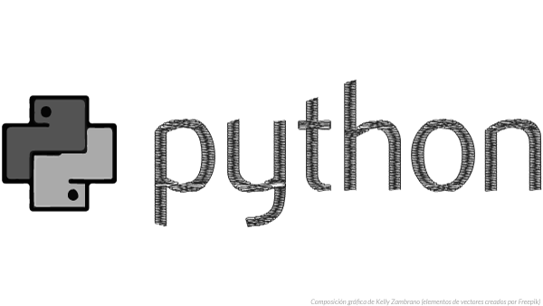
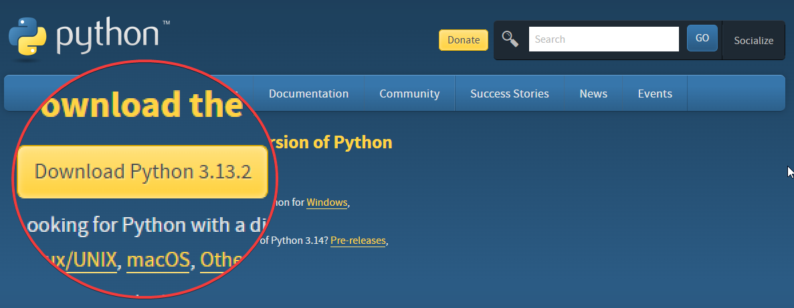
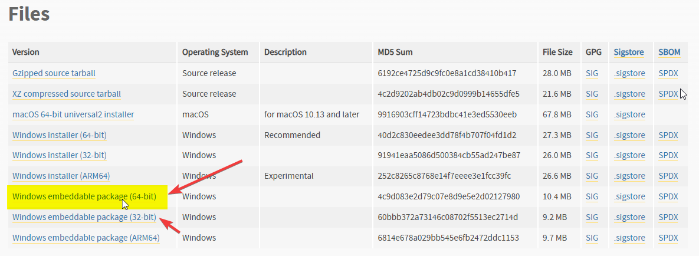
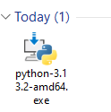

¿Estás buscando formas de automatizar tareas repetitivas en tu negocio? 

¿Te han dicho que Python puede ayudarte pero no sabes por dónde empezar? 

En esta guía te mostraré, paso a paso, cómo instalar Python para que puedas dar tus primeros pasos hacia la automatización empresarial.



## Proceso de Instalación de Python

### Paso 1: Preparativos Iniciales

**Todo muy bien, pero primero asegúrate de...**
- Tener al menos 2GB de espacio libre en tu disco duro
- Contar con Windows 7 o superior
- Tener permisos de administrador en tu computadora

### Paso 2: Descarga de Python

1. Ve al sitio oficial de Python: https://www.python.org/downloads/
2. Haz clic en el botón amarillo "Download Python X.X.X" (donde X.X.X es la última versión)



Si tienes Windows de 64 bits, descarga el instalador de 64 bits, o descarga la versión de 32 bits, si tu Windows trabaja con esta arquitectura.



> **Alternativa**: Abre Microsoft Store y busca "Python" (recomendado para principiantes)

### Paso 3: Instalación en Windows

Aquí es donde la magia comienza. Sigue estos pasos cuidadosamente:

1. Ejecuta el archivo descargado



2. **¡IMPORTANTE!** Marca la casilla "Add Python to PATH"
3. Selecciona "Install Now" para una instalación estándar
4. Espera a que termine el proceso

## Configuración después de la instalación

Una vez instalado Python, necesitamos verificar que todo está listo para usar. Abre el **Command Prompt** (cmd) y escribe:

```batch
python --version
```

Si ves algo como "Python 3.X.X", ¡felicidades! Ya tienes Python instalado.

### Instalando Paquetes con Pip

Pip es como una tienda de aplicaciones para Python. Para usarlo, escribe en cmd:

```batch
pip install nombre_del_paquete
```

Por ejemplo, para instalar pandas (una herramienta popular para análisis de datos):

```batch
pip install pandas
```

## Verificación de la Instalación

Hagamos una pequeña prueba. Abre el Command Prompt y escribe:

```python
python
```

Luego escribe:

```python
print("¡Mi empresa está lista para automatizar!")
```

Si ves el mensaje impreso, ¡todo está funcionando perfectamente!

### Solucionando Problemas Comunes


Si encuentras el error "Python no se reconoce como un comando interno":
1. Reinicia tu computadora
2. Si el problema ersiste, reinstala Python y asegúrate de que estás marcando "Add Python to PATH"

## Conclusiones

Instalar Python es el primer paso hacia la transformación digital de tu empresa. Con esta herramienta podrás:
- Ahorrar tiempo en tareas repetitivas
- Reducir errores humanos
- Analizar datos de manera más eficiente
- Tomar mejores decisiones basadas en datos

## ¿Y Ahora Qué?

¿Te ha resultado útil esta guía? 

¡Compártela con otros emprendedores que quieran optimizar sus procesos! 

¡Nos vemos! 🐌